# Twisted

Twisted is a web application designed to enable yarn lovers to collect, save and explore patterns.  This was built with React and Firebase.  
[Live link](https://twisted-9a506.web.app/)

## Table Of Contents
* Stack
* Folder structure
* npm commands
* dependencies
* Quick start
* Setup Firebase
* Install Firebase Tools
* Connect Project
* Build and Deploy
* Data structure

## Stack

**React**
Create React App
React Router    

**CSS**
**Firebase**
Authentication
Realtime Database
Storage
Function
Hosting

## Folder Structure

* twisted/
  * .firebase/
  * Build/
  *	Functions/
  * node_modules/
  * public/
  * src/
    * Assets/
    * Components/
        * AccountDetails/
        * AccountNavigationMain/
        * AddPattern/
        * Admin/
        * App/
        * FavoriteIcon/
        * Firebase/
        * Landing/
        * Main/
        * Navigation/
        * NotFoundPage/
        * PasswordChange/
        * PasswordForget/
        * PatternCard/
        * PatternDetail/
        * PatternEdit/
        * PatternFavs/
        * PatternPanel/
        * PatternsContributed/
        * Registration/
        * Services/
        * Session/
        * Signin/
        * SignOut/
        * SignUp/
        * Utils/
  *  constants/	

## NPM Commands

Script:      |       Description
------------ | ---------------------
npm start    |       Start webpack development server @localhost:3000
npm install  |       Install dependencies from package.json
npm run build|      Build the application to ./build directory
npm test     |       Test the application; watch for changes and retest

## Dependencies
    @firebase/testing: ^0.20.0
    @testing-library/jest-dom: ^4.2.4
    @testing-library/react: ^9.5.0
    @testing-library/user-event: ^7.2.1
    cors: ^2.8.5
    firebase: ^7.14.4
    firebase-functions: ^3.6.2
    react: ^16.13.1
    react-dom: ^16.13.1
    react-pdf: ^4.1.0
    react-router-dom: ^5.1.2
    react-scripts: 3.4.1
    react-tabs: ^3.1.0
    recompose: ^0.30.0

## Quick Start    
$ git clone https://github.com/sheilajmj/twisted.git

$ cd twisted

$ npm install

$ npm start

## Setup Firebase

* Create free firebase account [Firebase](https://firebase.google.com)
* Create a project from your Firebase console.
* Select Authentication and set up a sign-up method
* Select Database and choose Realtime Database
* Select Storage and ‘Get Started’ choose a location and this will create a default bucket
* Set up Resize Image Extension – from console, choose Extensions.  Locate and Install the Resize Image Extension
* Review APIs enabled and resources created
* Click	next
* Review access granted to this extension
* Click	next
* Configure Extension: 
	* Set storage, access,  and extension configurations
	* Size of Resized Images: 200x200
	* Deletion of original files: No
    * Cloud storage path for resized images: 	thumbnails
* Click to Install extension

## Install Firebase Tools
**Install Firebase JavaScript SDK**

If you do not have a package.json file yet use the 'npm init' command in the root directory of your project

        $ npm init 

To install firebase npm package

        $ npm install --save firebase 

**Install Firebase CLI**

Install Firebase CLI for deploying project to firebase and using cloud functions and extensions

        npm install -g firebase-tools

**Firebase Functions:**

Extensions:

Ext-storage-resize-images-generateResizedImage

## Connect Project
Set up project configuration in a new .env file. These variables are used in Component/Firebase/firebase.js to create the firebase config object.

Include:

REACT_APP_API_KEY

REACT_APP_AUTH_DOMAIN

REACT_APP_DATABASE_URL

REACT_APP_PROJECT_ID

REACT_APP_STORAGE_BUCKET

REACT_APP_MESSAGING_SENDER_ID

REACT_APP_APP_ID

REACT_APP_MEASUREMENT_ID

FIREBASE_TOKEN

## Build and Deploy
$ npm run build

$ firebase login

$ firebase use default

$ firebase deploy

## Database Data Structure
**Patterns**  
* Patterns/
  * M7_tMzh-15rtBgqPG9n/ 
    * Author_name: "Nicolor Strick Design"  *(author name)*
    * contributor_name: "sheilasheila" *(Name of contributor)*
    * contributor_user_id: "hhtSzlHwCxQwHzXhBldcKBQrOPy1" *(Contributor user Id)*
    * craft: "Knit"  *(pattern craft)*
    * description: "Cowl" *(pattern description)*
    * favorite/  *(list of user ids who have ‘favorited’ the pattern)*
      * N7J2bUMkTbcmeiLNZyQSGB7IJBO2: false *(User Id/ Boolean value is the pattern marked favorite true/false.  A user ID appears here if they marked the pattern favorite at any point, if it is no longer a favorite the value is changed to false)*
    * image_file_URL: https://firebasestorage.googleapis.com/v0/b/twi…  *(image file URL – this URL is generated when the image is uploaded the Firebase Storage)*
    * image_file_name: “IMG_2667_web.jpg”  *(image file name)*
    * needle_size: “US4 – 3.5mm” *(pattern needle size)*
    * pattern_id: “-M7_tMzh-15rtBgqPG9n” *(pattern ID (same as record ID – included in the pattern object here, for easier retrieval and use)*
    * pattern_name: “Don’t Touch Your Face” *(pattern name)*
    * pdf_file_URL: https://firebasestorage.googleapis.com/v0/b/twi… *(PDF file URL – this URL is generated when the file is uploaded to Firebase Storage)*
    * pdf_file_name: “DontTouchYourFace_en.pdf” *(pattern PDF file name)*
    * thumbnail_image_file_URL: https://firebasestorage.googleapis.com/v0/b/twi…” *(The thumbnail image file and corresponding URL are generated when the original image file is uploaded in Firebase.  (See firebase functions and extension above for additional information))*
    * thumbnail_image_file_name: “IMG_2667_web_200x200.jpg”  *(Thubmnail image file name is generated from the original image name, with the extension (_200x200) applied when firebase generates the thumbnail)*
    * yarn_weight: “Worsted” *(pattern yarn_weight) *

**Users**
* users/
    * f3VkCpSbBXaCwaf2QtUwnmc07wt2  *(record ID which is also the user Id)*
    * contributed/ *(this is a list of patterns this user has contributed)*
        * M8Xg2kmAB3YAVeeGFJV: true *(pattern Id and true Boolean value)*
    * email: anemail@gmail.com  *(user email address)*
    * favorites/ *(list of pattern id and details that the user has marked as a favorite) *
        * M7_tMzh-15rtBgqPG9n/  *(record id and pattern Id)*
            * M7_tMzh-15rtBgqPG9n: true  *(pattern id and boolean value (true currently marked as favorite, false – no longer marked as favorite)*
            * name: "sheilasheila" *(this name is the pattern contributor username)*
    * Roles/  *(user roles object)*
        * ADMIN: "ADMIN"  *(this is the option for user roles)*
    * username: "sampleUser" *(user’s username)*

## Storage Data Structure

* Images/ *(jpg/png only – name matches user submitted file name)*
    * ImageNames.jpg
    * Thumbnails/ *(Automatically generated - file name matches user uploaded file, plus _200x200 added before the file extension)*
        * ImageNames_200x200.jpg
* pattern-directions/
    * PatternName.pdf  *(PDF files only – name matches the user submitted file name)*

## Page Inventory

### Landing Page
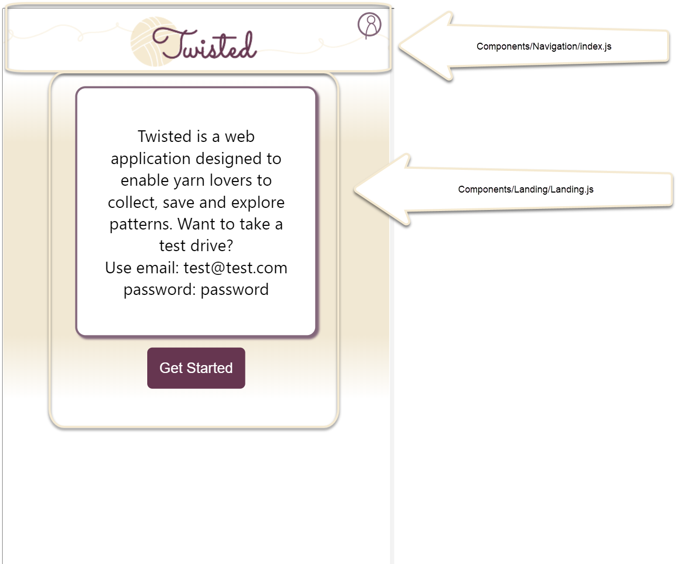

### Sign Up Page
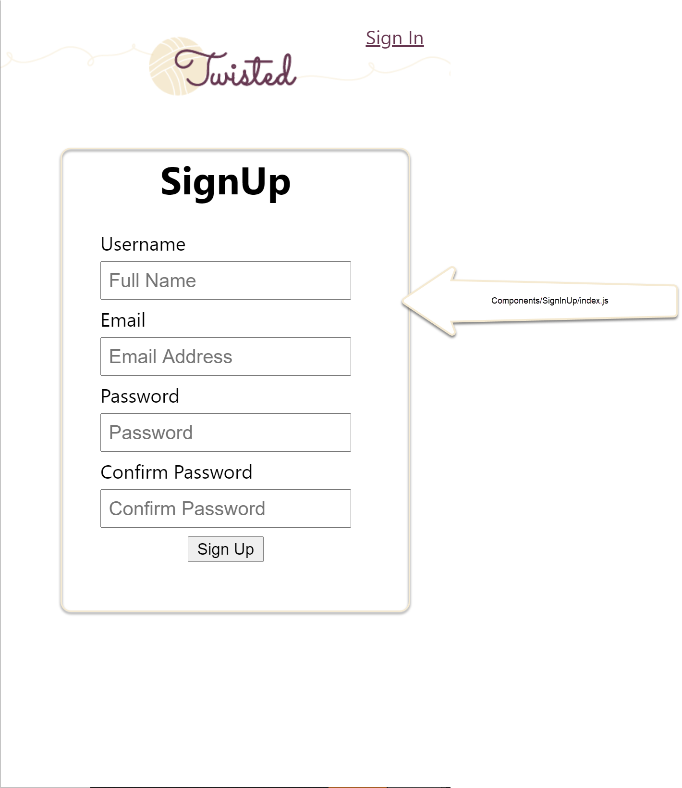

### Sign In Page
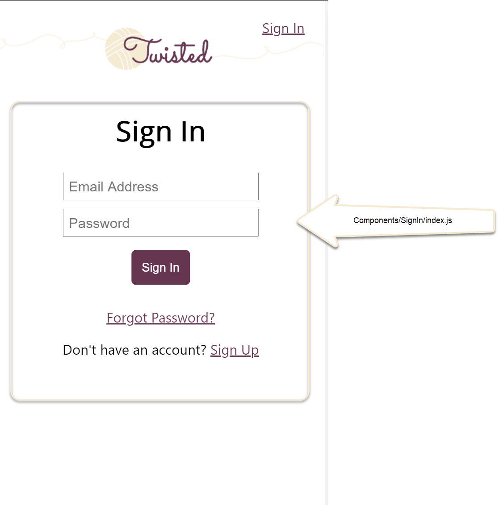

### Password Forgot Page
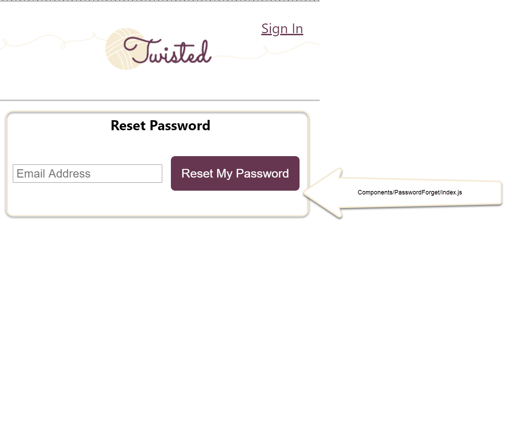

### Home
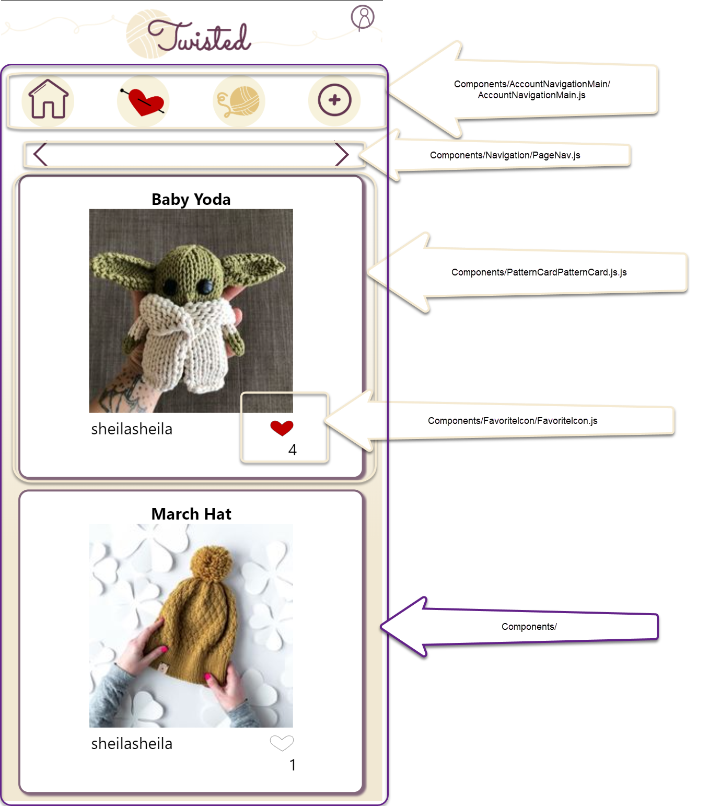

### Favorites
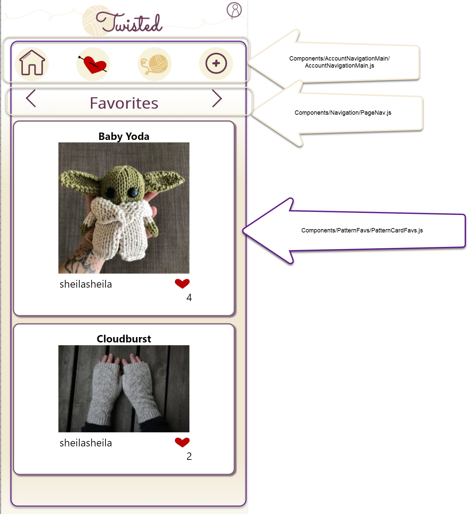

### Contributed
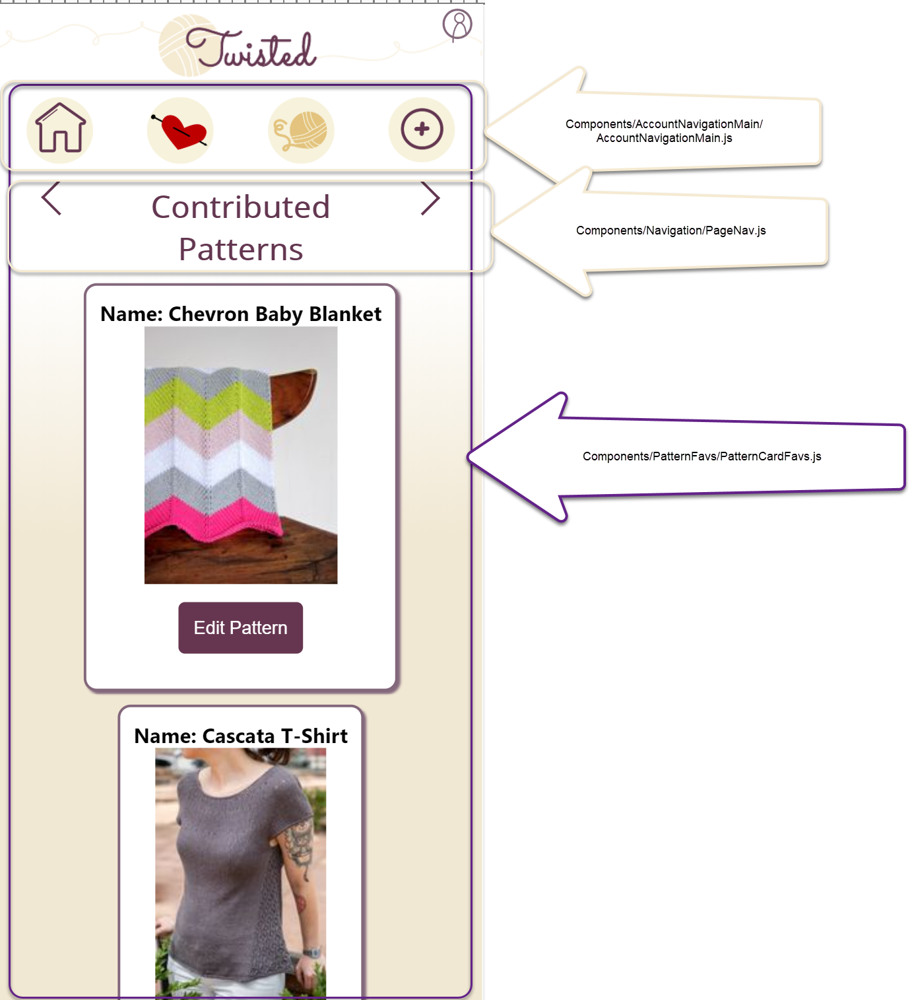

### Edit
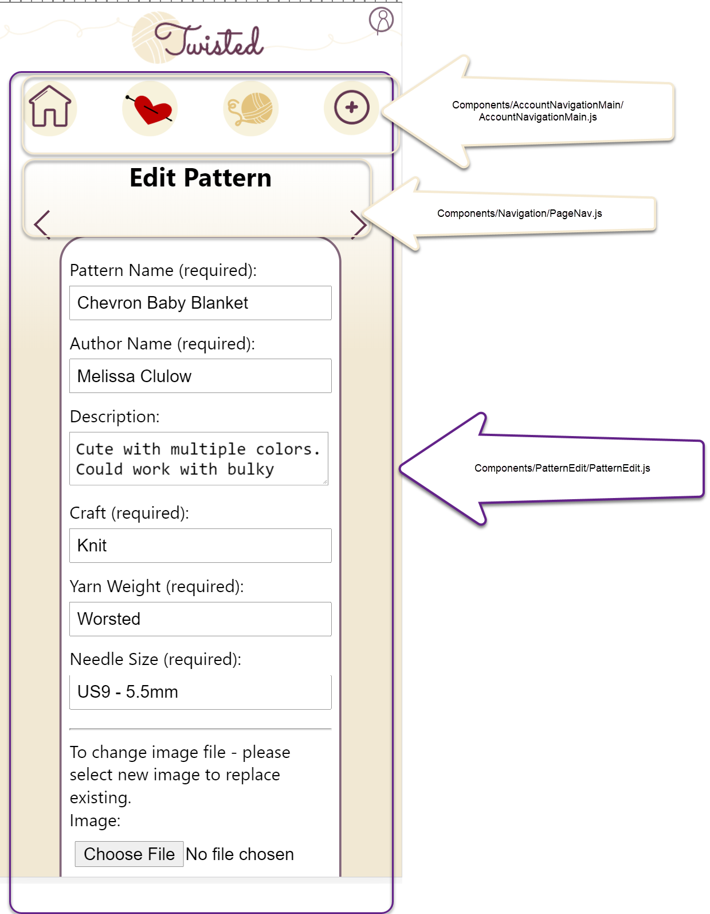

### Add New
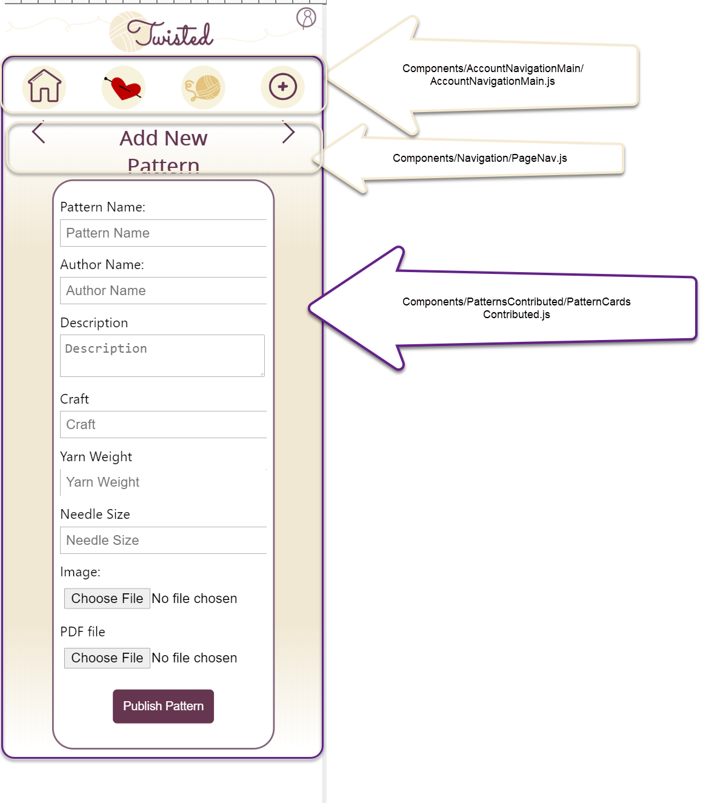

### Account Details
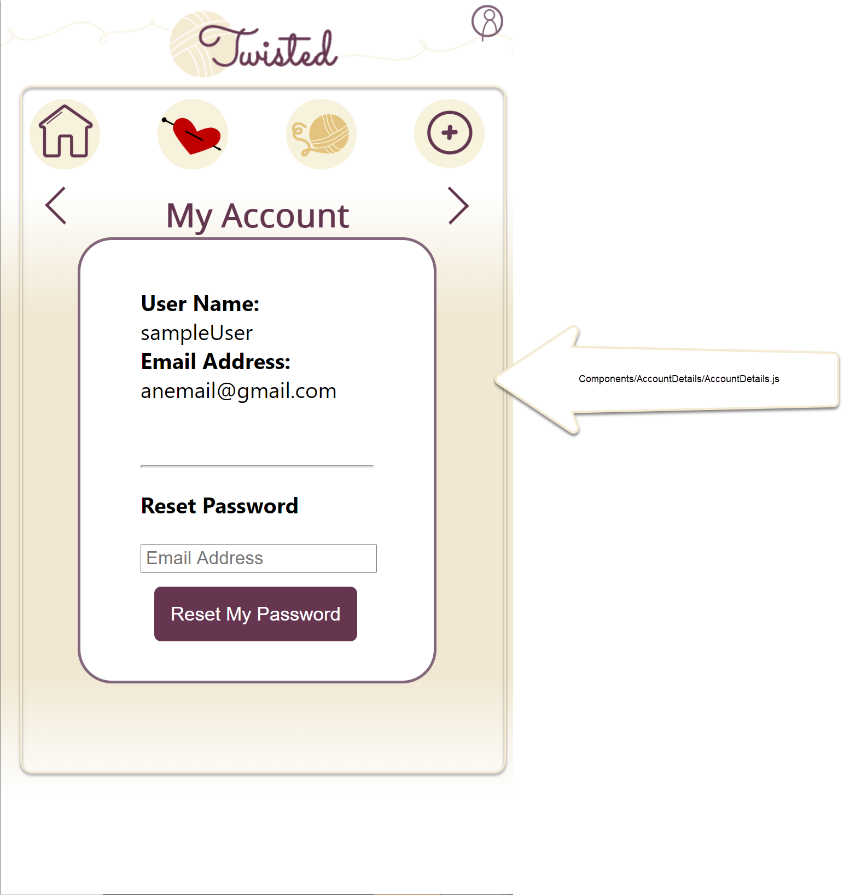

### Admin Page
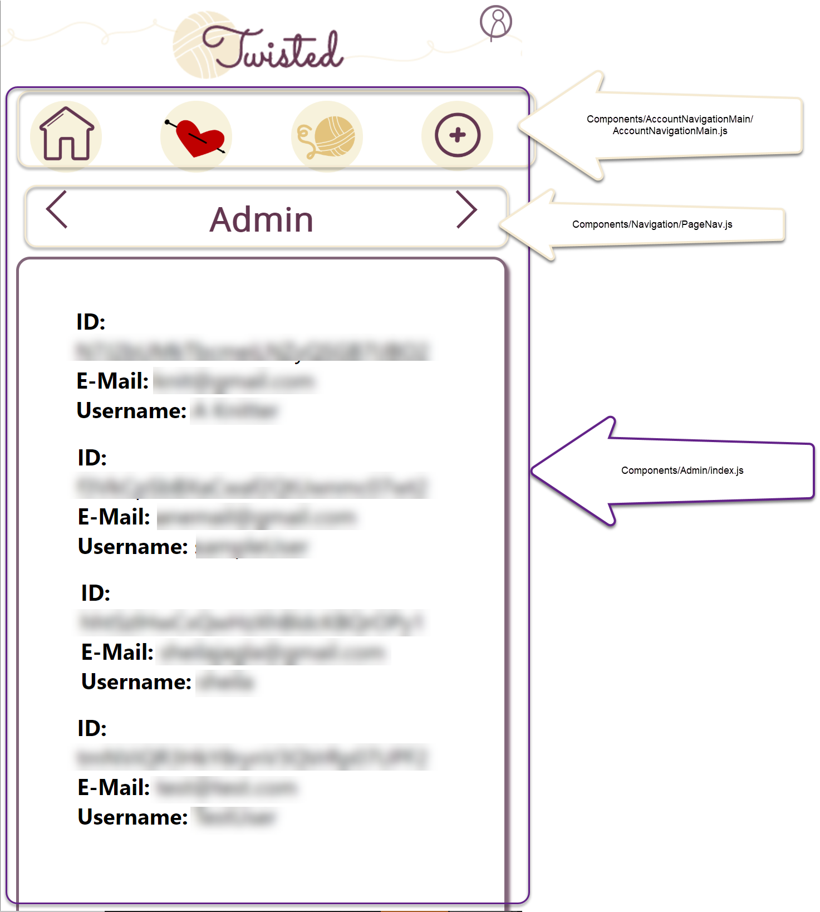

## Authors
Sheila Jagla - SheilaJagla
